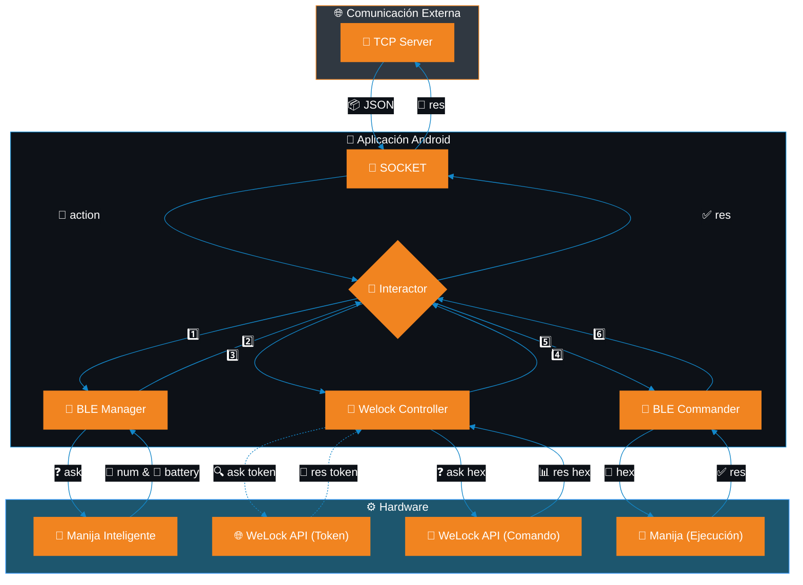

# 🔓 BleKotlin 🏠

<div align="center">
  <br/>
  
  
  
</div>

## 📱 Aplicación para Domotizar las Viviendas

> ✨ Conecta y controla dispositivos inteligentes para el hogar mediante BLE (Bluetooth Low Energy)

### 👨‍💻 Desarrollador

**MCH** - *Android Development Team*

All rights reserved ®

---

## 🚀 Guía de Inicio Rápido

### ⚠️ Configuración Importante

<details open>
<summary>Pre-instalación</summary>

```kotlin
// Antes de instalar, configurar en com.mch.blekot.common.Constants:
const val ID = "NOMBRE_PISO" // Debe coincidir con el código del piso en BBDD
```

➡️ En Android Studio, después de configurar el ID:
1. Selecciona la pestaña "Build"
2. Haz click en "Build Bundle / APK"
3. Se generará el APK para instalar en el dispositivo móvil

</details>

---

## 📋 Especificaciones Técnicas

### 📥 Parámetros de Entrada

Todas las comunicaciones se realizan mediante un único objeto JSON con valores en formato string.

<details>
<summary>Parámetros Comunes (todas las peticiones)</summary>

| Parámetro | Clave JSON | Descripción |
|-----------|------------|-------------|
| Identificador TCP | `"clientFrom"` | Identificador asignado por el TCP |
| Acción a realizar | `"cmd"` | Comando a ejecutar |

#### 📍 Comandos Disponibles
- `"openLock"` - Abrir cerradura
- `"newCode"` - Crear nuevo código
- `"setCard"` - Configurar tarjeta
- `"syncTime"` - Sincronizar tiempo
- `"openPortal"` - Abrir portal

</details>

<details>
<summary>Parámetros para OpenPortal</summary>

| Parámetro | Clave JSON | Descripción |
|-----------|------------|-------------|
| IP Arduino | `"ipArduino"` | Dirección IP del arduino |

</details>

<details>
<summary>Parámetros para Acciones con Manija</summary>

| Parámetro | Clave JSON | Descripción |
|-----------|------------|-------------|
| Dirección MAC | `"macAddress"` | MAC address de la manija |
| ID Dispositivo | `"deviceId"` | Identificador único de la manija |
| Nombre Bluetooth | `"deviceName"` | Nombre Bluetooth de la manija |

</details>

<details>
<summary>Parámetros Adicionales para NewCode</summary>

| Parámetro | Clave JSON | Descripción |
|-----------|------------|-------------|
| Duración | `"days"` | Días de duración del código |
| Código | `"code"` | Nuevo código a configurar |
| Índice | `"index"` | Posición donde se almacenará |
| Usos | `"times"` | Cantidad de veces que podrá usarse |

</details>

<details>
<summary>Parámetros para SetCard</summary>

| Parámetro | Clave JSON | Descripción |
|-----------|------------|-------------|
| QR | `"qr"` | Código QR de la llave |
| Tipo | `"type"` | Tipo de acción (1: agregar, 2: eliminar) |

</details>

---

### 📤 Respuestas

Las respuestas se envían en formato **JSON** y se crean en `com.mch.blekot.common.JsonManager.kt`.

> ⚠️ **Importante**: Siempre se debe llamar a `com.mch.blekot.model.socket.SocketSingleton.emitResponse()` para finalizar una acción (`isProcessActive = false`) y dejar el dispositivo listo para recibir nuevas peticiones.

<details>
<summary>Códigos de Estado</summary>

| Código | Descripción |
|--------|-------------|
| `1` | ✅ Éxito |
| `0` | ⏳ Hay una petición pendiente |
| `-1` | ❌ Error no especificado |
| `-2` | 📭 Falta enviar un parámetro desde el socket |
| `-3` | ⚠️ Error en la validación de parámetros |
| `-4` | 📵 El bluetooth del móvil no está encendido |
| `-5` | ⏱️ Tiempo de escaneo bluetooth agotado |
| `-6` | ⌛ Tiempo de procesamiento de petición agotado |
| `-7` | 🔒 Error en respuesta de WeLock-API |

</details>

<details>
<summary>Información adicional en respuestas</summary>

| Campo | Descripción |
|-------|-------------|
| `"msg"` | Mensaje informativo |
| `"clientFrom"` | Nombre (ID) del dispositivo móvil |
| `"startTime"` | Fecha/hora inicio validez |
| `"endTime"` | Fecha/hora fin validez |
| `"lockBattery"` | Porcentaje de batería de la manija |
| `"date"` | Fecha de la petición |

</details>

---

### ⏱️ Tiempos de Espera y Limitaciones

<details>
<summary>Timeouts y Limitaciones</summary>

- ⏳ **Petición**: Máximo 3 minutos para ser gestionada
- 🔍 **Escaneo BLE**: Máximo 30 segundos (normalmente tarda ~1 segundo)

> 💡 Si el error de escaneo se repite frecuentemente, probablemente exista un problema con la manija.

</details>

---

## 🔄 Flujo de la Aplicación

<details open>
<summary>Diagrama de Flujo</summary>



</details>

---

## 📚 Estructura del Proyecto

<details>
<summary>Principales Componentes</summary>

- **MainActivity.kt**: Punto de entrada principal
- **SocketService.kt**: Maneja las conexiones socket
- **Ble.kt**: Gestiona la comunicación Bluetooth Low Energy
- **WeLock.kt**: Controla la integración con cerraduras WeLock
- **JsonManager.kt**: Procesa la comunicación JSON

</details>

---

## 🔧 Solución de Problemas

<details>
<summary>Problemas Comunes</summary>

| Problema | Posible Solución |
|----------|------------------|
| La manija no se detecta | Verificar que el Bluetooth esté activado y que la manija tenga batería |
| Error en parámetros | Revisar que todos los parámetros JSON estén correctamente formateados |
| Timeout frecuente | Verificar la conectividad Bluetooth y la disponibilidad de la manija |

</details>

---

<div align="center">
    <p>Desarrollado con ❤️ por MCH</p>
</div>


